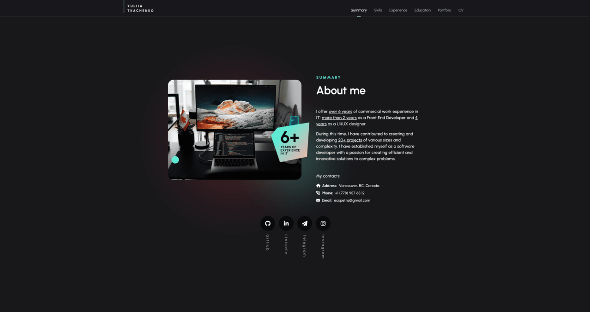
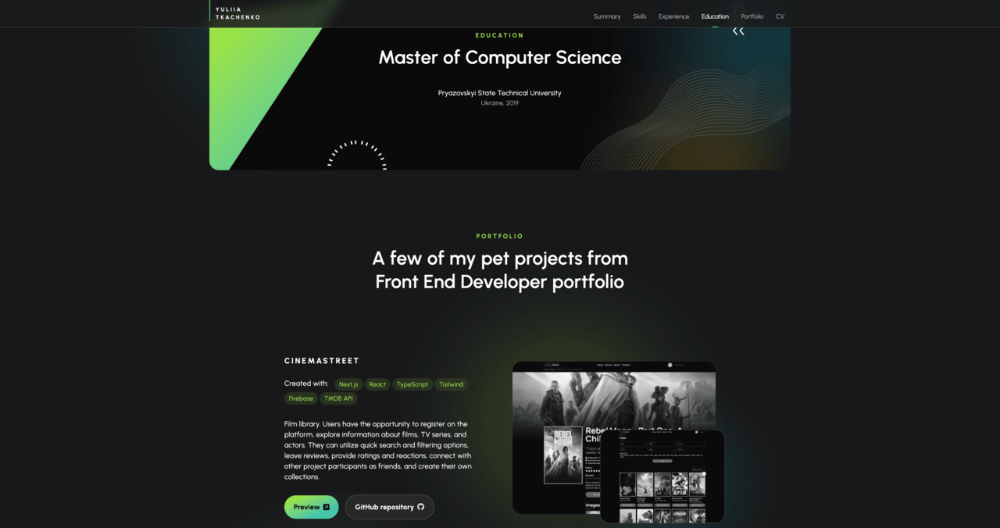

## Screenshots

## Description
My portfolio is designed and developed using Next.js, Typescript, and Tailwind. It showcases information about me, my skills, work experience, volunteering, examples of my projects, and contact information. The website features a unique design with GSAP library-based animations and a dynamic color scheme, ensuring a responsive layout across all devices.

## Link
https://www.yuliia-tkachenko.dev

## Created with:
Next.js, React, TypeScript, Tailwind, GSAP

Designed and developed by Yuliia Tkachenko, 2024

## Let's work together! &#128522;